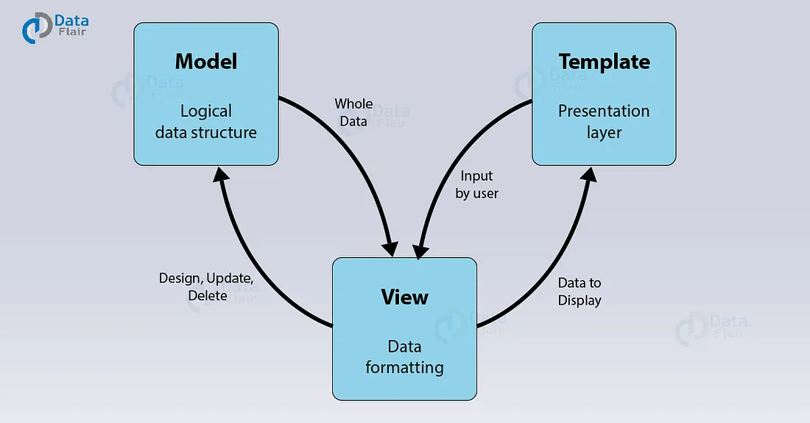

# Lesson 03: Django arxitekturasi va ishlash tamoyili

## 1. Django arxitekturasi

  
*Django MTV arxitekturasining umumiy ko‘rinishi*

  
*Model–Template–View o‘rtasidagi aloqalar sxemasi*

  
*So‘rov va javob oqimining bosqichma-bosqich ketma-ketligi*


Django — **MTV (Model–Template–View)** arxitekturasi asosida ishlaydi. Bu MVC (Model–View–Controller) ga juda o‘xshash, lekin Django’da nomlanish boshqacharoq:

- **Model**  
  - Ma’lumotlar bazasi bilan ishlash uchun mas’ul.  
  - `models.py` faylida yoziladi.  
  - ORM (Object Relational Mapping) orqali SQL yozmasdan bazada CRUD (Create, Read, Update, Delete) amallarini bajarish mumkin.

- **Template**  
  - Foydalanuvchiga ko‘rinadigan HTML qismini belgilaydi.  
  - `templates/` papkasida saqlanadi.  
  - Django Template Language (DTL) yordamida dinamik sahifalar yaratiladi.

- **View**  
  - Logika qismi.  
  - `views.py` faylida yoziladi.  
  - HTTP so‘rovlarini qabul qiladi va javob qaytaradi.  
  - Model va Template o‘rtasida "vositachi" rolini bajaradi.

---

## 2. Django’da so‘rov → javob jarayoni

Django qanday ishlashini tushunish uchun HTTP so‘rovi (request) va javobi (response) qanday oqimdan o‘tishini ko‘rib chiqamiz:

1. **Foydalanuvchi** browser orqali `https://example.com/about/` manziliga so‘rov yuboradi.  
2. **URL dispatcher** (`urls.py`) shu manzilni mos view funksiyasiga yo‘naltiradi.  
3. **View** funksiyasi:
   - kerak bo‘lsa **Model** bilan ishlaydi (bazadan ma’lumot oladi),
   - yoki to‘g‘ridan-to‘g‘ri **Template** ni chaqiradi.  
4. **Template** dinamik HTML sahifa yaratadi.  
5. **View** tayyor bo‘lgan HTML’ni foydalanuvchiga **Response** sifatida qaytaradi.  

---

## 3. Django arxitekturasi sxemasi

```text
Request  →  URLConf  →  View  →  Model → Template → Response
```

## 4. MTV va MVC solishtirish

| Django MTV | MVC’dagi nomlanish |
|:----------:|:------------------:|
| Model      | Model              |
| Template   | View               |
| View       | Controller         |


👉 Django’da **View** = **Controller**,
👉 Django’da **Template** = **View** sifatida qaraladi.


## 5. Xulosa
- **Django MTV arxitekturasi yordamida kod modullarga bo‘linadi va boshqarish osonlashadi.**
- **Request → Response oqimi aniq struktura asosida ishlaydi.**
- **Ushbu tamoyil loyihani kengaytirishga qulaylik yaratadi.**

**Keyingi dars:**
4-dars: Virtual muhitlar bilan tanishish. Pipenv o'rnatish va sozlash